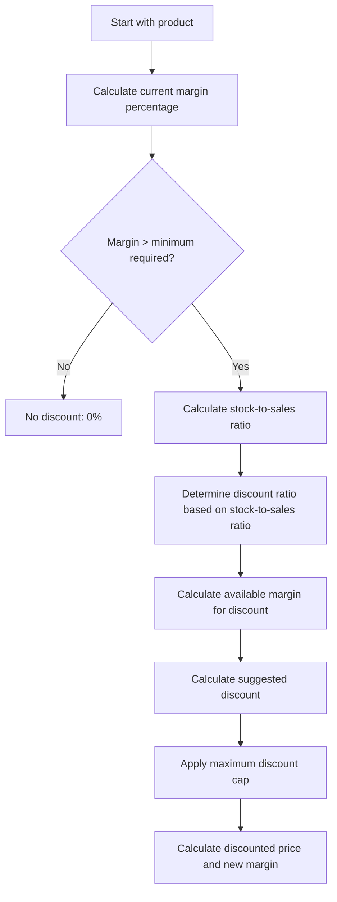

# Product Discount Suggestions

A Laravel application for syncing product data from an external API and automatically 
calculating optimal discount suggestions based on inventory levels, sales history, 
and margin requirements.

## Table of Contents

- [Overview](#overview)
- [Features](#features)
- [Installation](#installation)
- [System Architecture](#system-architecture)
- [Discount Calculation System](#discount-calculation-system)
    - [How Discounts Are Calculated](#how-discounts-are-calculated)
    - [Discount Calculation Flow](#discount-calculation-flow)
    - [Configuration Parameters](#configuration-parameters)
- [Database Schema](#database-schema)
- [API Synchronization](#api-synchronization)
- [Console Commands](#console-commands)
- [Frontend Components](#frontend-components)
- [Testing](#testing)

## Overview

This application helps businesses optimize product pricing by suggesting appropriate 
discounts based on stock levels, sales performance, and profit margin requirements. 
It synchronizes product data, inventory, and order history from an external API and 
applies a configurable algorithm to recommend discount percentages 
that help balance inventory without sacrificing profitability.

## Features

- **API Integration**: Automatically sync products, stock, and order data from an external API
- **Smart Discount Algorithm**: Calculate optimal discount percentages based on:
    - Current stock levels
    - Sales history
    - Profit margin requirements
- **Interactive Dashboard**: View product statistics and discount suggestions through a responsive Livewire UI
- **Configurable Parameters**: Adjust discount calculation rules to match your business requirements

## Installation

1. Clone the repository:
   ```bash
   git clone https://github.com/rawaby88/deal-detector
   ```

2. Make the start script executable:
   ```bash
   chmod +x start.sh
   ```

3. Run the start script:
   ```bash
   ./start.sh
   ```

4. **Provide your API token when prompted**.

   > **Note**: You **must provide a valid API token** to successfully sync products from the API.

The script will:
- Copy the example environment file
- Create a SQLite database file
- Install Composer dependencies
- Set your API token in the .env file
- Build and start Docker containers
- Install Laravel dependencies
- Run database migrations
- Generate application key
- Sync products from the API
- Install and build frontend assets

## System Architecture

The application follows a standard Laravel MVC architecture with the following components:

- **Models**: Product, Stock, Order, and OrderItem classes that represent database entities
- **Services**: Business logic for API synchronization and discount calculations
- **Commands**: Console commands for data synchronization and discount generation
- **Livewire Components**: Interactive frontend elements for displaying and filtering data

## Discount Calculation System

### How Discounts Are Calculated

The application implements a smart discount algorithm that analyzes product data to suggest optimal
discount percentages. The system balances two key business objectives:

1. **Reducing excess inventory**: Products with high stock-to-sales ratios receive larger discount suggestions
2. **Maintaining profitability**: Discounts are capped to ensure a minimum profit margin is preserved

The discount calculation system uses several factors to determine the optimal discount percentage for each product:

1. **Margin Analysis**:
    - Calculates the current margin percentage for each product
    - Only products with margins above the minimum threshold are eligible for discounts

2. **Stock-to-Sales Ratio Analysis**:
    - Calculates the ratio between current stock and historical sales
    - Higher ratios (overstocked items) receive larger discounts
    - Lower ratios (limited stock items) receive smaller or no discounts

3. **Discount Calculation**:
    - Determines the "available margin" (current margin minus minimum required margin)
    - Applies a percentage of the available margin as a discount, based on the stock-to-sales ratio
    - Ensures the new margin after discount still meets the minimum threshold

### Discount Calculation Flow



### Calculation Examples

Let's walk through some examples to illustrate how the discount calculation works in practice:

#### Example 1: High-Margin Product with High Stock-to-Sales Ratio

**Product Data:**
- Price: €100.00
- Purchase Price: €60.00
- Stock Quantity: 50 units
- Sales Count: 5 units
- Configuration: Minimum Margin = 20%, Maximum Discount Ratio = 0.8

**Calculation Steps:**
1. Calculate current margin percentage:
    - Margin = (100 - 60) / 100 * 100 = 40%

2. Check if margin > minimum required (40% > 20%): Yes

3. Calculate stock-to-sales ratio:
    - Ratio = 50 / 5 = 10.0

4. Determine discount ratio:
    - Ratio = 10.0 equals high ratio threshold, so discount ratio = 0.9 (90%)

5. Calculate available margin for discount:
    - Available Margin = 40% - 20% = 20%

6. Calculate suggested discount:
    - Suggested Discount = 20% * 0.9 = 18%

7. Apply maximum discount cap:
    - Maximum Allowed = 20% * 0.8 = 16%
    - Final Discount = min(18%, 16%) = 16%

8. Calculate discounted price and new margin:
    - Discounted Price = €100 * (1 - 16/100) = €84
    - New Margin = (€84 - €60) / €84 * 100 = 28.6%

**Result:** 16% discount, reducing price from €100 to €84, with a new margin of 28.6%

#### Example 2: Low-Margin Product

**Product Data:**
- Price: €100.00
- Purchase Price: €85.00
- Stock Quantity: 40 units
- Sales Count: 5 units
- Configuration: Minimum Margin = 20%, Maximum Discount Ratio = 0.8

**Calculation Steps:**
1. Calculate current margin percentage:
    - Margin = (100 - 85) / 100 * 100 = 15%

2. Check if margin > minimum required (15% > 20%): No

3. No further calculation needed

**Result:** 0% discount (no discount), as the product's margin is already below the minimum threshold

#### Example 3: Medium-Margin Product with Low Stock-to-Sales Ratio

**Product Data:**
- Price: €100.00
- Purchase Price: €70.00
- Stock Quantity: 5 units
- Sales Count: 10 units
- Configuration: Minimum Margin = 20%, Maximum Discount Ratio = 0.8

**Calculation Steps:**
1. Calculate current margin percentage:
    - Margin = (100 - 70) / 100 * 100 = 30%

2. Check if margin > minimum required (30% > 20%): Yes

3. Calculate stock-to-sales ratio:
    - Ratio = 5 / 10 = 0.5

4. Determine discount ratio:
    - Ratio = 0.5 is below low ratio threshold (2.0), so discount ratio = 0.1 (10%)

5. Calculate available margin for discount:
    - Available Margin = 30% - 20% = 10%

6. Calculate suggested discount:
    - Suggested Discount = 10% * 0.1 = 1%

7. Apply maximum discount cap:
    - Maximum Allowed = 10% * 0.8 = 8%
    - Final Discount = min(1%, 8%) = 1%

8. Calculate discounted price and new margin:
    - Discounted Price = €100 * (1 - 1/100) = €99
    - New Margin = (€99 - €70) / €99 * 100 = 29.3%

**Result:** 1% discount, reducing price from €100 to €99, with a new margin of 29.3%

### Configuration Parameters

The discount calculation system uses several configurable parameters (defined in `config/aquaventures.php`):

| Parameter | Description | Default Value |
|-----------|-------------|---------------|
| `minimum_margin_percentage` | The minimum margin percentage that must be maintained after applying discounts | 20% |
| `maximum_discount_ratio` | The maximum percentage of available margin that can be used for discounts | 0.8 (80%) |
| `stock_sales_ratio.low_ratio` | Stock-to-sales ratios below this value receive minimum discounts | 2.0 |
| `stock_sales_ratio.high_ratio` | Stock-to-sales ratios above this value receive maximum discounts | 10.0 |

## Database Schema

The application uses the following database tables:

1. **products**
    - `id`: Primary key
    - `name`: Product name
    - `slug`: URL-friendly product identifier
    - `image`: Optional product image URL
    - `description`: Product description
    - `price_in_cents`: Original price in cents
    - `purchase_price_in_cents`: Purchase/cost price in cents
    - `margin_percentage`: Calculated margin percentage
    - `suggested_discount_percentage`: Calculated discount percentage
    - `discounted_price_in_cents`: Price after discount in cents
    - `new_margin_percentage`: Margin percentage after discount

2. **stocks**
    - `id`: Primary key
    - `product_id`: Foreign key to products
    - `quantity`: Current stock quantity

3. **orders**
    - `id`: Primary key
    - `ordered_at`: Order date/time
    - `total_price_in_cents`: Total order price in cents

4. **order_items**
    - `id`: Primary key
    - `order_id`: Foreign key to orders
    - `product_id`: Foreign key to products
    - `quantity`: Quantity ordered
    - `unit_price_in_cents`: Unit price in cents at time of order

## API Synchronization

The application synchronizes data from an external API using the `ApiService` class, which handles:

1. **Authentication**: Uses the configured API token to authenticate requests
2. **Data Retrieval**: Fetches products, stocks, and orders from the API
3. **Data Synchronization**: Updates the local database with the latest information
4. **Error Handling**: Logs errors and provides status reports for API operations

The API synchronization is triggered by the `app:sync-api-database` command, which is automatically run during installation.

## Console Commands

The application includes the following console commands:

1. **`app:sync-api-database`**: Syncs product, stock, and order data from the external API
   ```bash
   php artisan app:sync-api-database
   ```

2. **`app:generate-product-discount`**: Calculates and stores discount suggestions for all products
   ```bash
   php artisan app:generate-product-discount
   ```

## Frontend Components

The UI is built using Laravel Livewire and includes the following components:

1. **Product Stats**: Displays overall statistics including:
    - Total products count
    - Products with discounts count and percentage
    - Average and highest discount percentages
    - Total inventory quantity
    - Potential savings from applying all discounts

2. **Product Discount Helper**: Shows the current discount configuration and provides an explanation of how discounts are calculated

3. **Product Discount List**: Shows a paginated, searchable, and sortable list of all products with their:
    - Current price
    - Stock quantity
    - Sales count and stock-to-sales ratio
    - Current margin percentage
    - Suggested discount percentage
    - Discounted price
    - New margin percentage after discount

## Testing

The application includes comprehensive tests for both backend and frontend functionality:

1. **Unit Tests**: Test individual services and calculations
    - `DiscountCalculationServiceTest`: Tests discount calculation functions
    - `GenerateProductDiscountsTest`: Tests the discount generation command

2. **Feature Tests**: Test end-to-end functionality
    - `DiscountSystemFeatureTest`: Tests the entire discount system workflow

3. **Livewire Component Tests**: Test frontend components
    - `ProductDiscountHelperTest`: Tests the discount helper component
    - `ProductStatsTest`: Tests the product statistics component
    - `ProductDiscountListTest`: Tests the product list component

Run tests using:
```bash
php artisan test
```
